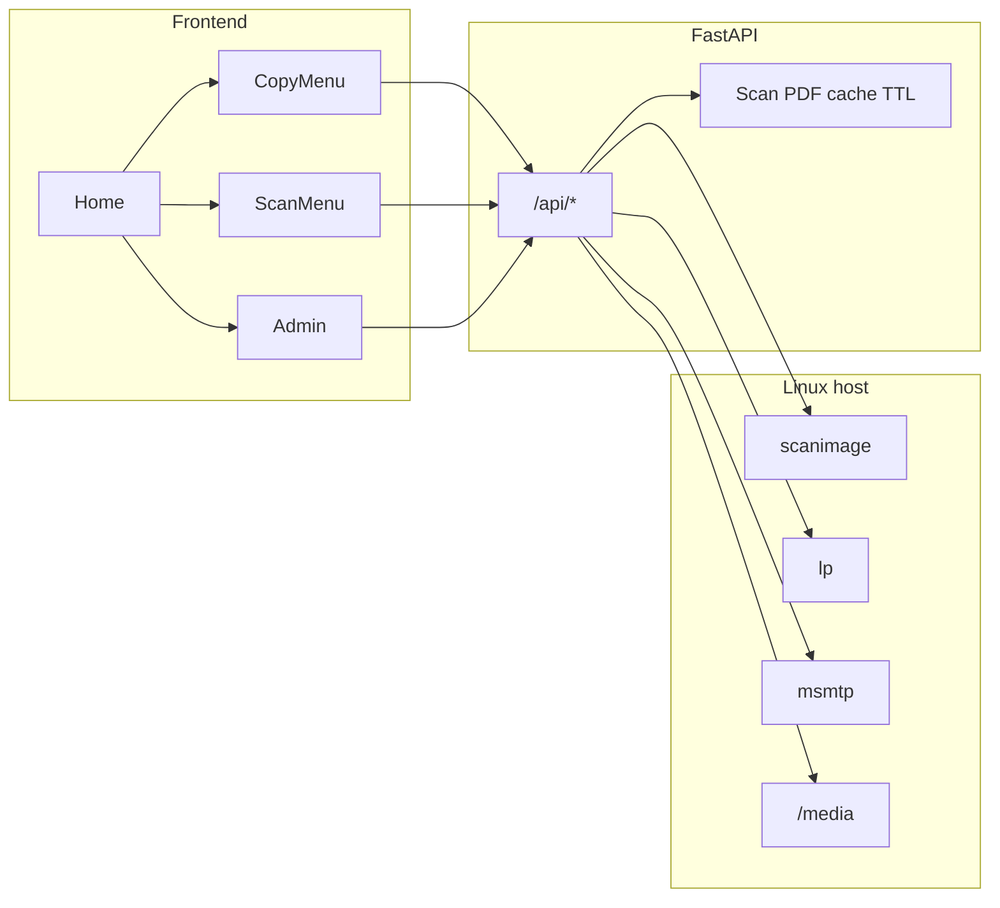

# Kopi — Linux Smart Copier Appliance

Kiosk-style **Smart Copier** for a dedicated Linux host: a fullscreen browser runs a touch-friendly UI that talks to a **FastAPI** backend. The backend bridges **SANE** (`scanimage`), **CUPS** (`lp`), **msmtp** (outbound mail), and writable paths under **`/media`** (USB).

The npm package in `frontend/` is named **`kopi`**; the UI brands the product as “Smart Copier” / Linux Smart Copier Appliance.

## Architecture

- **Frontend** ([`frontend/`](frontend/)): React 18, Vite, React Router, Tailwind. Dev server defaults to port **5173** and proxies `/api` to the backend ([`frontend/vite.config.ts`](frontend/vite.config.ts)). Optional `VITE_API_URL` overrides the API base ([`frontend/src/api.ts`](frontend/src/api.ts)).
- **Backend** ([`backend/`](backend/)): FastAPI app in [`backend/main.py`](backend/main.py). Integrations live under [`backend/services/`](backend/services/) (`scanner`, `printer`, `mailer`, `usb_manager`, `hardware`).
- **Hardware abstraction** ([`backend/services/hardware.py`](backend/services/hardware.py)): `KOPI_HARDWARE_MODE` = `real` | `mock` | `auto` (default). In `auto`, **Linux** uses real subprocesses; **non-Linux** uses mocks (delays + synthetic PDF) for development without SANE/CUPS.



## User flows and API

| Flow | Endpoints | Notes |
|------|-----------|--------|
| **Copy** | `POST /api/scan` → `POST /api/print` | Scan PDF cached in memory by `scan_id` (TTL). Print consumes the cache; on failure the PDF is restored for retry. |
| **Scan to email** | `POST /api/scan/email` | Single-sided scan; PDF attached; sent via `msmtp` using SMTP from settings. |
| **Scan to USB** | `POST /api/scan/usb` | Writes a timestamped PDF to the first writable path under `/media`. |
| **Admin** | `POST /api/admin/verify`, `GET/PUT /api/admin/settings` | SMTP + admin password in JSON; `GET/PUT` require `X-Admin-Password`. |

**Health:** `GET /api/health` → `{"status":"ok"}`.

## Configuration

- **Settings file:** [`backend/config/settings.json`](backend/config/settings.json) — `smtp` and `admin_password`. Override path with **`SETTINGS_PATH`**.
- **Scanner:** optional **`SCAN_DEVICE`**, **`SCANIMAGE_EXTRA_ARGS`** (see [`backend/services/scanner.py`](backend/services/scanner.py)).
- **Printer:** optional **`CUPS_DEST`** (see [`backend/services/hardware.py`](backend/services/hardware.py)).
- **Scan cache TTL:** **`KOPI_SCAN_TTL_SEC`** (default `300`).
- **CORS:** **`CORS_ORIGINS`** (comma-separated; default includes `http://localhost:5173`).
- **Log level:** **`KOPI_LOG_LEVEL`** (see [`backend/logging_config.py`](backend/logging_config.py)).
- **Server port (embedded uvicorn):** **`PORT`** when running `python main.py` (default `8000`).

## Prerequisites

- **Python 3.10+** (recommended) with pip.
- **Node.js 18+** and npm for the frontend.
- **On the appliance:** `scanimage`, `lp`, and `msmtp` on `PATH` when using real hardware mode.

## Local development

**Backend** (from repo root):

```bash
cd backend
python -m venv .venv
source .venv/bin/activate   # Windows: .venv\Scripts\activate
pip install -r requirements.txt
python main.py
# or: python -m uvicorn main:app --host 0.0.0.0 --port 8000 --reload
```

**Frontend:**

```bash
cd frontend
npm install
npm run dev
```

With the default Vite proxy, open the app at `http://localhost:5173`; API calls to `/api` go to `http://127.0.0.1:8000`.

On macOS or Windows, leave `KOPI_HARDWARE_MODE` unset (or set `mock`) so scans and prints do not require Linux tools.

## Security notes

Admin and SMTP credentials are stored in plain JSON on disk; admin API uses a shared password header. Treat this as suitable for a **locked appliance**, not for exposure to the open internet. The in-memory scan cache is **single-process** and **ephemeral** (restarts drop pending `scan_id`s).

## Repository layout

| Path | Role |
|------|------|
| [`backend/main.py`](backend/main.py) | FastAPI routes and scan store |
| [`backend/services/`](backend/services/) | Scanner, printer, mail, USB, hardware bridges |
| [`backend/config/settings.json`](backend/config/settings.json) | SMTP + admin password |
| [`frontend/src/views/`](frontend/src/views/) | Home, Copy, Scan, Admin screens |
| [`frontend/src/components/`](frontend/src/components/) | Kiosk UI building blocks |
